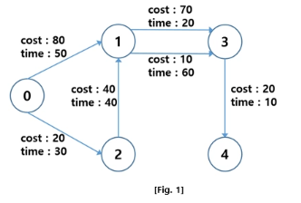
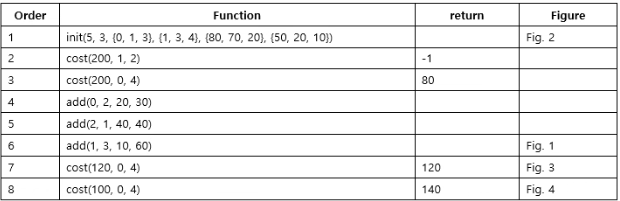
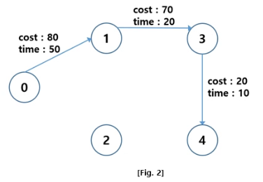
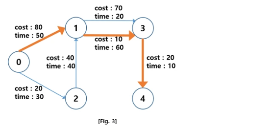
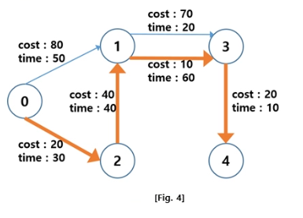

[문제 설명]
N 개의 도시가 주어진다. 각 도시는 0부터 N-1까지 ID값을 가진다.
도시를 연결하는 단방향 도로가 주어지는데, M 비용 내에서 이동할 떄 소요되는 최소 시간을 구하고자 한다.
(다익스트라 알고리즘을 활용하고자 한다면, 1차원 배열을 2차원 배열로 확장할 필요가 있다.)
[Fig. 1]은 5개의 도시가 주어진 예이다.

M이 200이라면, 0번 도시에서 4번 도시로 이동할 수 있는 최소 시간은 80이다
(0 --(cost:80, time:50) --> 1 --(cost:70, time:20) --> 3 --(cost:20, time:10)--> 4)
M이 200이라면, 0번 도시에서 4번 도시로 이동할 수 있는 최소 시간은 120이다
(0 --(cost:80, time:50) --> 1 --(cost:10, time:60) --> 3 --(cost:20, time:10)--> 4)
M이 100이라면, 0번 도시에서 4번 도시로 이동할 수 있는 최소 시간은 140이다
(0 --(cost:20, time:30) --> 2 --(cost:40, time:40) --> 1 --(cost:10, time:60)--> 3 --(cost:20, time:10)--> 4)

아래 API 설명을 참조하여 각 함수를 구현하라

아래 함수 signature는 C/C++에 대한 것으로 다른 언어에 대해서는 제공되는 Main과 User Code를 참고하라

아래는 User Code 부분에 작성해야 하는 API 의 설명이다

---
void init(int N, int K, int sCity[], int eCity[], int mCost[], int mTime[])

---
각 테스트 케이스의 처음에 호출된다.
N개의 도시가 주어진다. 각 도시는 0부터 N-1까지 ID값을 가진다.
K개의 도로 정보가 주어진다. 각 도로의 출발 도시와 도착 도시, 그리고 도로를 이용할 때 필요한 비용과 소요 시간이 주어진다.
단방향 도로이기 때문에 출발 도시에서 도착 도시로만 갈 수 있다.
출발 도시와 도착 도시의 순서쌍이 동일한 도로가 2개 이상 주어질 수 있다.
출발 도시와 도착 도시가 서로 같은 경우는 없다.

Parameters
    N: 도시의 개수 (5 <= N <= 100)
    K: 도로의 개수 (3 <= K <= 500)

    (0 <= i < K)인 모든 i에 대해
    sCity[i]: 도로의 출발 도시 (0 <= sCity[i] < N)
    eCity[i]: 도로의 도착 도시 (0 <= eCity[i] < N)
    mCost[i]: 도로의 이용 비용 (1 <= mCost[i] <= 100)
    mTime[i]: 도로의 소요 시간 (1 <= mTime[i] <= 100)

--- 
void add(int sCity, int eCity, int mCost, int mTime)

---
출발 도시가 sCity이고, 도착 도시가 eCity이고, 이용 비용이 mCost이고, 소요 시간이 mTime인 도로를 추가한다.
init()에 없던 새로운 도시는 주어지지 않는다.
sCity에서 eCity로 가는 도로가 이미 존재할 수 있다.

Parameters
    sCity: 도로의 출발 도시 (0 <= sCity < N)
    eCity: 도로의 도착 도시 (0 <= eCity < N)
    mCost: 도로의 이용 비용 (1 <= mCost <= 100)
    mTime: 도로의 소요 시간 (1 <= mTime <= 100)

---
int cost(int M, int sCity, int eCity)

---
최대 M까지 비용을 사용할 수 있을 때, sCity에서 eCity로 이동하는데 소요되는 최소 시간을 반환한다.
출발 도시와 도착도시가 서로 같은 경우는 없다

Parameters
    M: 사용 가능한 총 비용 (1 <= M <= 1000)
    sCity: 출발 도시 (0 <= sCity < N)
    eCity: 도착 도시 (0 <= eCity < N)

Returns
    M 비용 내에서, sCity에서 eCity로 이동이 가능하다면, 이 때 소요되는 최소 시간을 반환한다.
    불가능하다면, -1을 반환한다.

---
[예제]
아래의 [Table 1]과 같이 요청이 되는 경우를 살펴보자

(순서 1) 5개의 도시와 3개의 도로 정보가 주어진다. 함수 호출의 결과는 [Fig. 2]와 같다.

(순서 2) 200 비용 내에서, 1번 도시에서 2번 도시로 이동하는데 소요되는 최소 시간을 계산한다.
1번 도시에서 2번 도시로 이동이 불가능하기 때문에 -1을 반환한다.

(순서 3) 200 비용 내에서, 0번 도시에서 4번 도시로 이동하는데 소요되는 최소 시간으로 80을 반환한다.
(순서 4) 0번 도시에서 2번 도시로 갈 수 있는 도로가 추가된다. 이용 비용은 20이고 소요 시간을 30이다.
(순서 5) 2번 도시에서 1번 도시로 갈 수 있는 도로가 추가된다. 이용 비용은 40이고 소요 시간은 40이다.
(순서 6) 1번 도시에서 3번 도시로 갈 수 있는 도로가 추가된다. 이용 비용은 10이고 소요 시간은 60이다. 
함수 호출의 결과는 [Fig. 1]과 같다.
(순서 7) 120 비용 내에서, 0번 도시에서 4번 도시로 이동하는데 소요되는 최소 시간으로 120을 반환한다.
이동 경로는 [Fig. 3]과 같다.

(순서 8) 100 비용 내에서, 0번 도시에서 4번 도시로 이동하는데 소요되는 최소 시간으로 140을 반환한다.
이동 경로는 [Fig. 4]와 같다.

[제약사항]

1. 각 테스트 케이스 시작 시 init() 함수가 호출된다.

2. 각 테스트 케이스에서 add() 함수의 호출 횟수는 1,000이하이다.

3. 각 테스트 케이스에서 cost() 함수의 호출 횟수는 100이하이다.

[입출력]
입출력은 제공되는 Main 부분의 코드에서 처리하므로 User Code 부분의 코드에서는 별도로 입출력을 처리하지 않는다.
Sample input 에 대한 정답 출력 결과는 "#TC번호 결과"의 포맷으로 보여지며 결과가 100 일 경우 정답, 0일 경우 오답을 의미한다.
---
